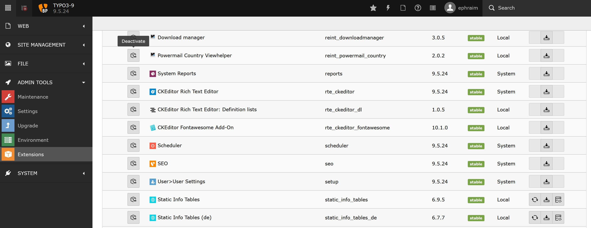

.. ==================================================
.. FOR YOUR INFORMATION
.. --------------------------------------------------
.. -*- coding: utf-8 -*- with BOM.

.. include:: ../Includes.txt

.. _admin-manual:

Administrator Manual
====================

Target group: **Administrators**

This extension is easy to install and to configure.
It depends on the powermail extension but it can be installed without powermail, because it adds only ViewHelpers.

.. _admin-installation:

Installation
------------

To install the extension, perform the following steps:

#. Go to the Extension Manager
#. Install static_info_tables for English country names and execute the
#. Install other static_info_tables extensions (see all on :ref:`What does it do <what-it-does>`)
#. Execute the update scripts after installation of a static_info_tables extension for each extension to add the database entries!
#. Install the extension reint_powermail_country

   Installation of static_info_tables

   Execute the update script after installation of a static_info_tables extension

.. _admin-configuration:

Configuration
-------------

#. Go to your country select template e.g. /yourPowermailTemplatesPath/Partials/Form/Country.html
#. Insert the new namespace and change the select field like in the example below
#. Do not change the template in the powermail extension folder, because after an update you will loose it!!!

**Example Country.html template:**

::

		{namespace vh=In2code\Powermail\ViewHelpers}
		{namespace rvh=RENOLIT\ReintPowermailCountry\ViewHelpers}

		<f:comment>
			{vh:Form.Countries()} will try to get the country list from the extension static_info_tables (and _de, _fr etc...)
			If static_info_tables is not installed, a static list of countries and the ISO3 code will be shown in frontent
			If you want to change sorting, Value or Label, please install static_info_tables
		</f:comment>

		

			

				<label for="powermail_field_{field.marker}" class="powermail_label" title="{field.description}">
					<vh:string.RawAndRemoveXss>{field.title}</vh:string.RawAndRemoveXss><f:if condition="{field.mandatory}">*</f:if>
				</label>
			

			

				<f:form.select
					property="{field.marker}"
					options="{rvh:Form.Countries(key:'isoCodeA3',value:'officialNameLocal',sortbyField:'isoCodeA3',sorting:'asc',other:'1')}"
					prependOptionLabel="{f:translate(key:'pleaseChoose')}"
					class="powermail_field powermail_country {vh:Validation.ErrorClass(field:field, class:'powermail_field_error')}"
					value="{vh:Misc.PrefillField(field:field)}"
					id="powermail_field_{field.marker}" />
			

		

Only the new namespace was added at the top:

**{namespace rvh=RENOLIT\ReintPowermailCountry\ViewHelpers}**

And the options for the country select field have to be changed:

**{rvh:Form.Countries(key:'isoCodeA3',value:'officialNameLocal',sortbyField:'isoCodeA3',sorting:'asc',other:'1')}**