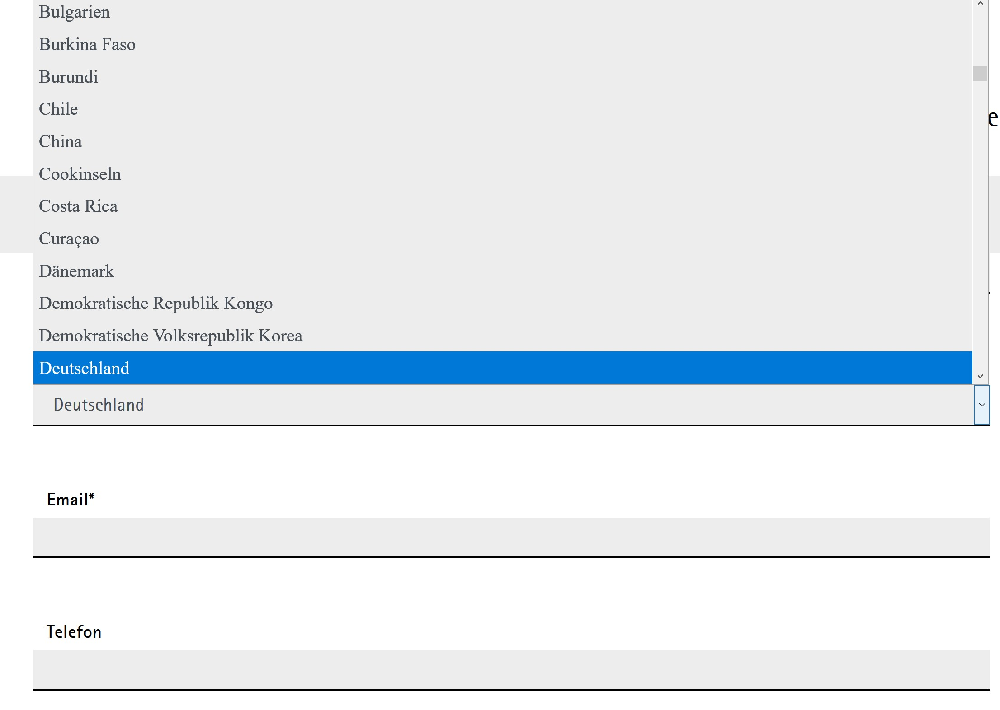

.. ==================================================
.. FOR YOUR INFORMATION
.. --------------------------------------------------
.. -*- coding: utf-8 -*- with BOM.

.. include:: ../Includes.txt

.. _introduction:

Introduction
============

.. _what-it-does:

What does it do?
----------------

This extension provides a ViewHelper and an example template for the powermail country field.
It uses the static_info_tables(_iso2) extensions for the countries (like it is done in powermail).

Following is done:

- Sorting is done with the default powermail functionality
- See the example template in /Resources/Private/Partials/Form/Field/Country.html

.. _screenshots:

Screenshots
-----------

   Country select

   A country select with German translated countries ordered by name and with "other country" option.
